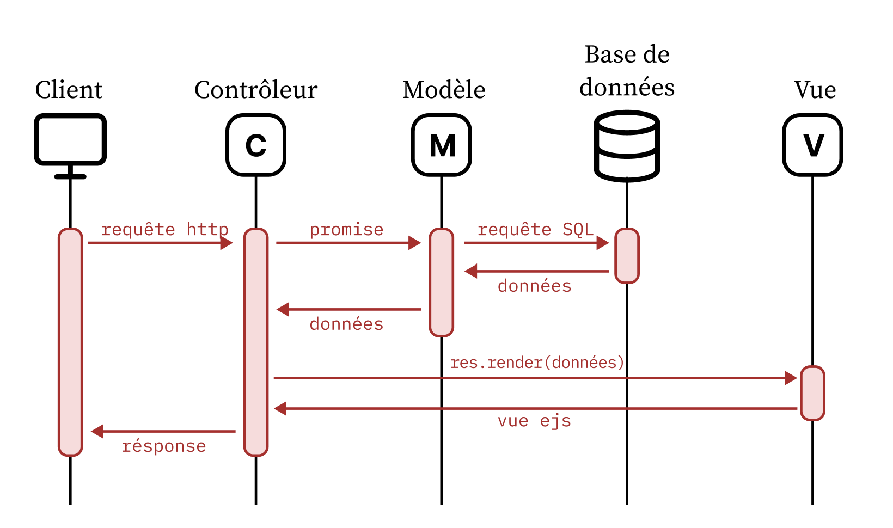

# Projet SR10 - Readme

## Technologies utilisées

On utilise le stack technique suivant: 
- le serveur web ```Node.js```
- les langages de programmation ```HTML, CSS, JavaScript```
- le framework ```Bootstrap``` (CDN) pour ses styles CSS pré-définis
- le framework ```Express``` qui implémente l'architecture MVC (Modèle Vue Contrôleur)
- le moteur de visualisation ```EJS```
- le framework ```Jest``` pour implémenter les tests unitaires complété du module ```supertest```pour les tests d'intégration

</br>

## Pour faire fonctionner le serveur

Cloner le dépôt puis ouvrir un terminal et taper: 
```bash
cd .\SR10\SR10_project\
npm start
```

Puis ouvrir un navigateur web et taper dans la barre de recherche : 
http://localhost:3000/LogIn.

Pour ne pas avoir d'erreur lors de la connexion, il faut se connecter au **VPN** de l'UTC pour avoir accès à la base de données.

Le compte utilisateur de **Luc Bernard** permet d'avoir accès à toutes les fonctionnalités du site, il a tous les privilèges:
- Adresse email : luc.bernard@mail.com
- Mot de passe : mdp123

**Doe John** n'a pas les privilèges admin, il a un compte candidat/recruteur:
- Adresse email : Doe@gmail.com
- Mot de passe : SecurePass123!

**Nina Robert** a les privilèges admin mais pas les privilèges recruteurs:
- Adresse email : nina.robert@mail.com
- Mot de passe : mdp123

Pour créer un **nouveau compte** utilisateur, taper dans votre navigateur : http://localhost:3000/SignUp. Par défaut, l'utilisateur n'a pas de privilèges, seulement un compte candidat. 

Vous pouvez changer d'espace utilisateur grâce aux boutons en bas à droite des pages d'accueil ou grâce aux routes suivantes:
- http://localhost:3000/candidat/Accueil
- http://localhost:3000/recruteur/accueil
- http://localhost:3000/admin/accueil

Des mesures de sécurité ont été mises en place pour que les routes admin et recruteur ne soient accessibles que si les privilèges ont été accordés. Un message d'erreur "Accès interdit" s'affichera sinon. Pour demander les accès, vous pouvez vous rendre dans l'onglet "privilèges" accessible  depuis tous les espaces. La demande sera alors envoyée aux administrateurs dans l'attente de leur validation.

</br>

## Organisation du dépôt Git

Le dépôt git est organisé selon l'arborescence suivante:
- le dossier `/conception` contient le **diagramme des cas d'utilisation** (UseCaseDiagram), le **diagramme de classes** (UML) et le **modèle logique de données** (MLD). La **carte du site web** est accessible sur le figma suivant : [Conception des routes, de l'interface et des fonctionnalités](https://www.figma.com/design/l7j4jq5fwSGC3Mfd4yWi7d/SR10-Maquette?node-id=0-1&t=OZ16zT2FTczzaGUG-1)
- le dossier `/Db` contient les **requêtes SQL** qui ont été exécutées pour créer les tables SQL et insérer les jeux de données dans notre base de données
- le dossier `/SR10_project` contient notre application et est structuré selon l'architecture **MVC (Modèle Vue Contrôleur)**. En voici le diagramme de séquence :



Pour implémenter l'architecture MVC, on utilise un framework de node.js : le **framework express**. Le projet express généré contient déjà la partie Vue `/views` et la partie Contrôleur `/routes` de l'architecture MVC. On a crée un dossier pour la partie Modèle `/model`. La création de routes permet de connecter les trois parties de l'architecture.

### Contrôleur
Le **contrôleur** est composé de plusieurs sous-routes ; cela rend le code plus lisible et strucuré. On décompose et organise les routes par **type d'utilisateurs** :
- `index.js` prend en charge les requêtes de *création de compte et de connexion*, il redirige ensuite vers la route qui gère l'espace candidat.
- `candidat.js` contient toutes les **sous-routes** relatives à l'espace candidat : *Voir les offres, Mes candidatures, Privilèges*
- `admin.js` contient toutes les **sous-routes** relatives à l'admin : *Gestion des utilisateurs, Gestion des demandes, Gestion des organisations, Privilèges*
- `recruteur.js` contient toutes les **sous-routes** relatives à l'espace recruteur : *Gérer mes offres, Gérer mes fiches de poste, Privilèges*

Cette stratégie permet de sécuriser simplement l'accès aux routes avec les sessions.


### Modèle

Le dossier `/model` représente la partie modèle de l'architecture MVC. Il contient : 
- `db.js` qui implémente la connexion à la base de donnée MySQL
- pour chaque table utile de notre base de données, un fichier qui contient les opérations de **persistance CRUD** (create, read, update, delete) et d'autres plus spécifiques

</br>


## Comment filtrer, rechercher et paginer les données ?

Le projet étant de taille réduite, on choisit de développer des scripts qui permettent de filtrer, rechercher et paginer **côté client** ; le serveur envoie toutes les données au client qui ne les affiche pas toutes. Dans le cadre d'un projet avec une grande quantité de données, on aurait pu filtrer les données **côté serveur**, avant l'envoie au client ; cette stratégie est plus optimale en therme de consommation énergétique.


## Tests (TD qualité du code)

On utilise le framework de tests automatisés pour JavaScript `Jest`.
Pour contrôler la **couverture de code**, c'est-à-dire le poucentage de métriques couvertes par les tests dans le projet, ouvrez un terminal et tapez : 
```bash
cd .\SR10\SR10_project\
npm run test
```

### Tests unitaires : tester les fonctions CRUD

Les tests unitaires permettent de tester chaque fonctions indépendamment des autres. Ainsi, on donne une entrée à cette fonction et on vérifie que la sortie est celle attendue grâce à l'assertion `expect()`.

Le champ des possibles des fonctions à tester est énorme, on décide de se limiter aux tests unitaires permettant de vérifier la persistance des données. On vérifie ainsi le bon fonctionnement des fonctions CRUD :
- CREATE : test de création d'utilisateur (model.create)
- READ : test de lecture d'un champ d'un utilisateur (model.read)
- READALL
- UPDATE : test de mise à jour d'utilisateur (model.update)
- DELETE : test de suppression d'utilisateur (model.delete), on vérifie qu'une et une seule ligne a été affectée avec `expect(result.affectedRows).toBe(1);`


D'autres tests
- vérification du mot de passe choisi par l'utilisateur, il doit être conforme aux recommandations de la CNIL
- vérifier que toutes les candidatures contiennent une pièce jointe


### Tests d'intégration : tester des routes

Pour faire des tests complets de l'application, il faudrait le décliner sur tous les domaines du dossier route; on se concentre ici sur le domaine candidat. Les tests implémentés sont : 
- marche pas qd nn authent
- recup page qui existe pas => page qui existe pas


## TD4 : formulaires et sessions

### Formulaires

Pour ajouter et modifier des données dans notre base de données, on utilise des formulaires. On présente ici l'exemple du formulaire de **création de compte**.

D'abord, pour rendre le formulaire accessible à l'utilisateur, on crée une vue EJS avec des champs à remplir qu'on affiche avec une requête GET :

```javascript
//CONTROLEUR
router.get('/SignUp', function(req, res, next) {
  res.render('SignUp', { title: 'Accueil', text: 'Bienvenue' });
});
```

Une fois la vue affichée, l'utilisateur peut remplir les différents champs puis, grâce à un bouton, envoyer les valeurs remplies dans un objet `body` avec une requête POST. Le contrôleur récupère ces données et demande la création d'un nouvel utilisateur au modèle à partir de ces données.


```javascript
//CONTROLEUR
router.post('/SignUp', async (req, res) => {
    //récupération des valeurs de l'objet body de la requête req
    const { phone, lastname, firstname, email, password } = req.body;
    const status = 'Active'; //par défaut, on active le compte
    //appelle le modèle
    await users.create(phone, lastname, firstname, status, password, email);
    // Redirection vers la page de connexion
    res.redirect('/LogIn');
});
```

Le contrôleur fait une requête SQL à la base de données pour insérer dans les champs de la table Utilisateur les valeurs transmises par le contrôleur:

```javascript
//MODELE
create: async function (phone, lastName, firstName, status, password, email) {
    const query = 'INSERT INTO Utilisateur (Phone, LastName, FirstName, Status, Password, Email) VALUES (?, ?, ?, ?, ?, ?)';
    const result = await db.query(query, [phone, lastName, firstName, status, password, email]);
    return result
  },
  ```

On affiche ensuite un popup pour avertir l'utilisateur que son compte a bien été créé.

#### Vérification du bon fonctionnement


On ajoute une ligne ```console.log("req.body", req.body);``` dans le contrôleur pour vérifier qu'on récupère bien les valeurs rentrées par l'utilisateur. Ici, on voit d'abord l'affichage de la vue avec GET, puis la récupération de l'objet body par le controleur dans la requête POST, puis la redirection vers la page /LogIn avec GET.

```bash
GET /SignUp 304 12.952 ms - -
req.body [Object: null prototype] {
  phone: '668',
  lastname: 'Jean',
  firstname: 'Cholet',
  email: 'jean@gmail.com',
  password: 'MDP8--_'
}
POST /SignUp 302 239.308 ms - 56
GET /LogIn 304 8.249 ms - -
```


